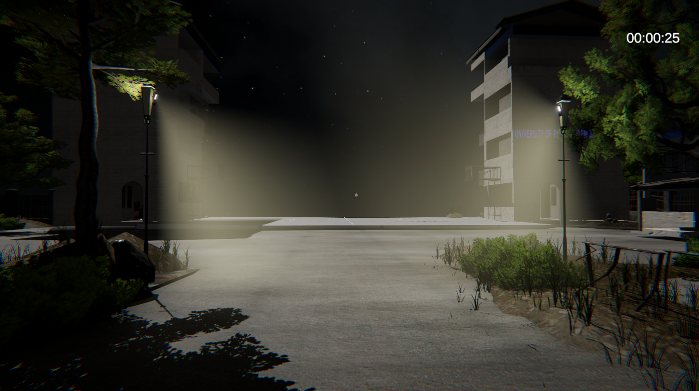
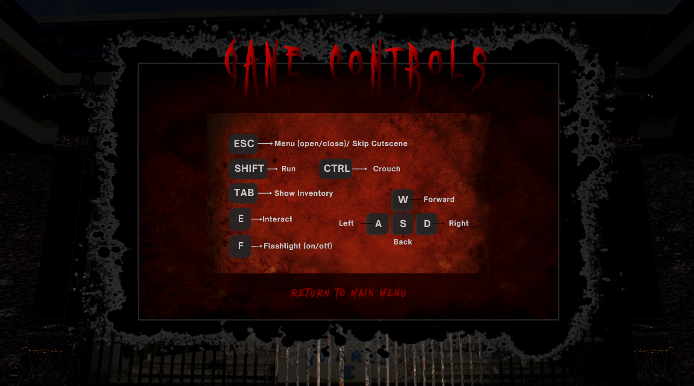
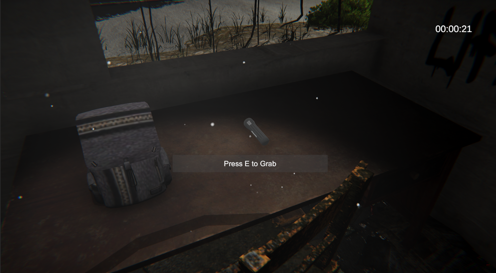
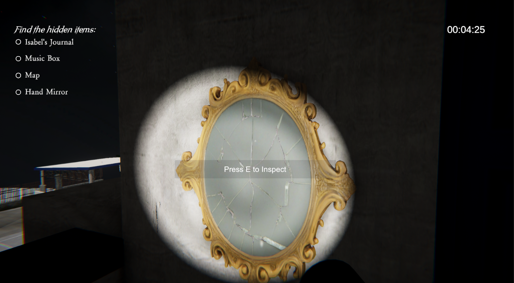
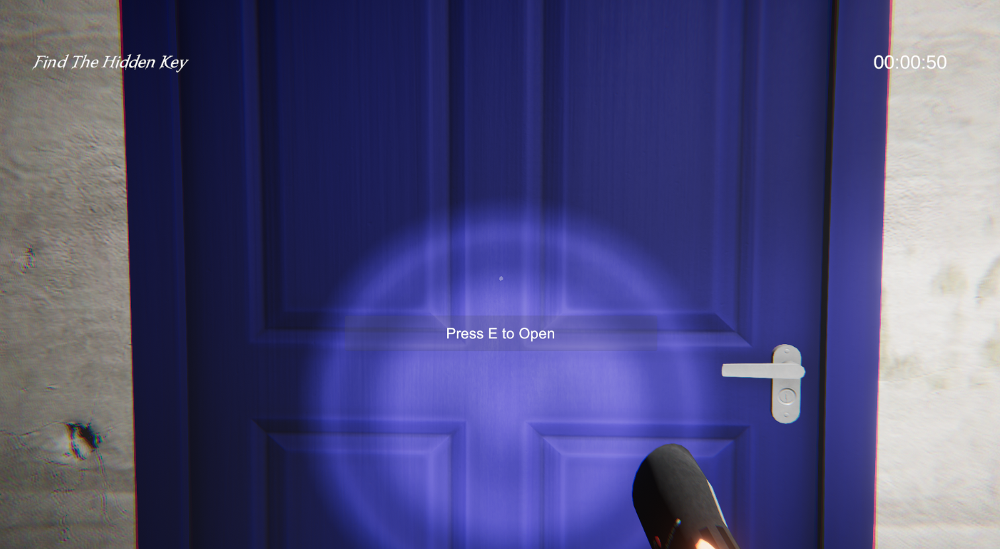

# 🎮 Finding Isabel

A psychological horror desktop game developed as a capstone project using Unity.

---

## 🎥 Gameplay Trailer

▶️ [Watch on YouTube](https://www.youtube.com/watch?v=XxoQJfI3ArE&t=25s)

---

## 📖 About

**Finding Isabel** is a psychological horror game where players explore eerie environments, solve puzzles, and uncover a mysterious story. The game focuses on atmospheric exploration, suspense, and immersive storytelling.

---

## 🛠️ Tech Stack

- Unity
- C#
- Unity ProBuilder
- Unity Asset Store
- Quixel Assets
- Mixamo
- Blender
- Unity Built-in Render Pipeline

---

## 📦 Project Status

**Completed**  
Capstone Project (2026)

---

## 👥 Team

Developed as a capstone project with a team of student developers.

---

## 📸 Screenshots

### 🎮 Gameplay Start

### 🎮 Controls

### 🧠 Interaction System

### 🔍 Inspect System

### 🚪 Door Interaction

---

## 🚀 Features

- Psychological horror gameplay
- Story-driven exploration
- Puzzle solving
- Atmospheric environments
- Immersive sound design
- First-person gameplay

---

## 📄 Note

This repository serves as a portfolio showcase for the project. Some assets belong to their respective creators through the Unity Asset Store, Quixel, and Mixamo.
